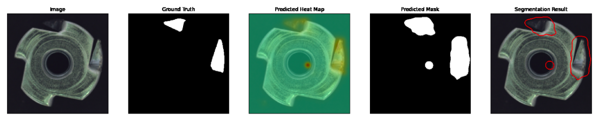

    

Unsupervised anomaly detection using Anomalib
=============================================

## Description

This repository describes the implementation of an unsupervised anomaly detector on metallic nuts using the Anomalib library. Thereby we evaluate several state-of-the-art deep learning models such as PaDiM, PatchCore, STFPM, FastFlow and Reverse Distillation. 

The data used was The MVTEC Anomaly Detection Dataset ([MVTec AD](https://www.mvtec.com/company/research/datasets/mvtec-ad)), but only the metal nut dataset was used. The training was performed locally on a laptop with an NVIDIA GeForce GTX 1050 Ti GPU and Ubuntu 20.04 LTS operating system.

It is recommended to download the dataset from this [link](https://www.mydrive.ch/shares/38536/3830184030e49fe74747669442f0f282/download/420937637-1629952063/metal_nut.tar.xz), and organize the dataset in the format shown in the main notebook.

The implementation is fully described in the main notebook: **unsupervised-anomaly-detection.ipynb**.

## Author

Dennis Hernando NÚÑEZ FERNÁNDEZ    
[https://dennishnf.com](https://dennishnf.com)

## References

- Akcay, S., Ameln, D., Vaidya, A., Lakshmanan, B., Ahuja, N., & Genc, U. (2022). Anomalib: A Deep Learning Library for Anomaly Detection. doi:10.48550/ARXIV.2202.08341    
- https://blog.ml6.eu/a-practical-guide-to-anomaly-detection-using-anomalib-b2af78147934    
- https://openvinotoolkit.github.io/anomalib/    
- https://pypi.org/project/anomalib/    
- https://www.kaggle.com/code/ipythonx/mvtec-ad-anomaly-detection-with-anomalib-library/notebook    
- https://www.mvtec.com/company/research/datasets/mvtec-ad    

